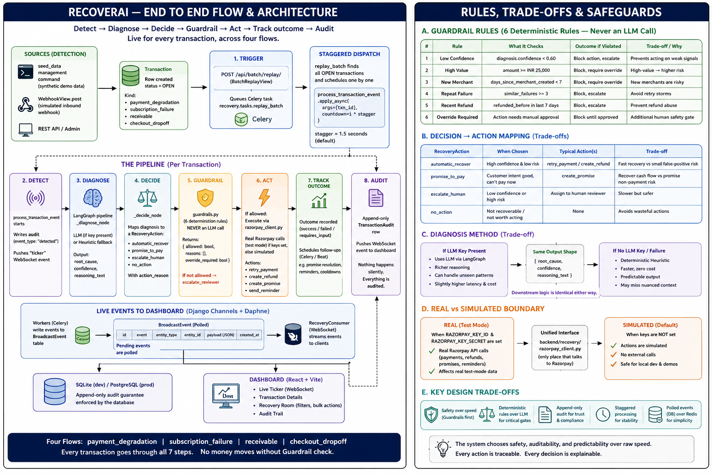
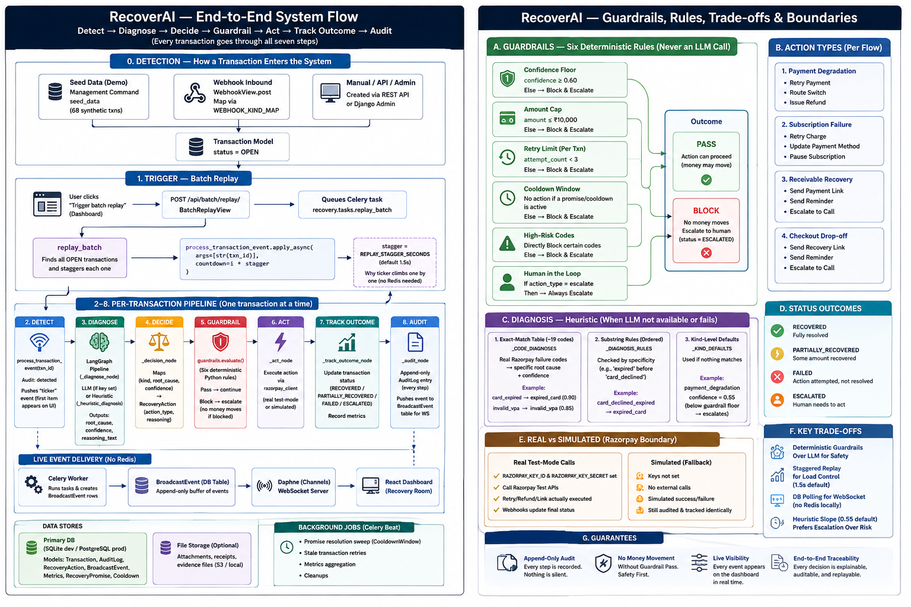

# Architecture

Two full end-to-end diagrams of RecoverAI — the flow (detect → diagnose → decide →
guardrail → act → track outcome → audit) and the guardrail rules, decision mapping,
diagnosis method, and real-vs-simulated boundary that constrain it. See
[HOW_IT_WORKS.md](HOW_IT_WORKS.md) for the written walkthrough these diagrams visualize.

## Diagram v1

## Diagram v2

